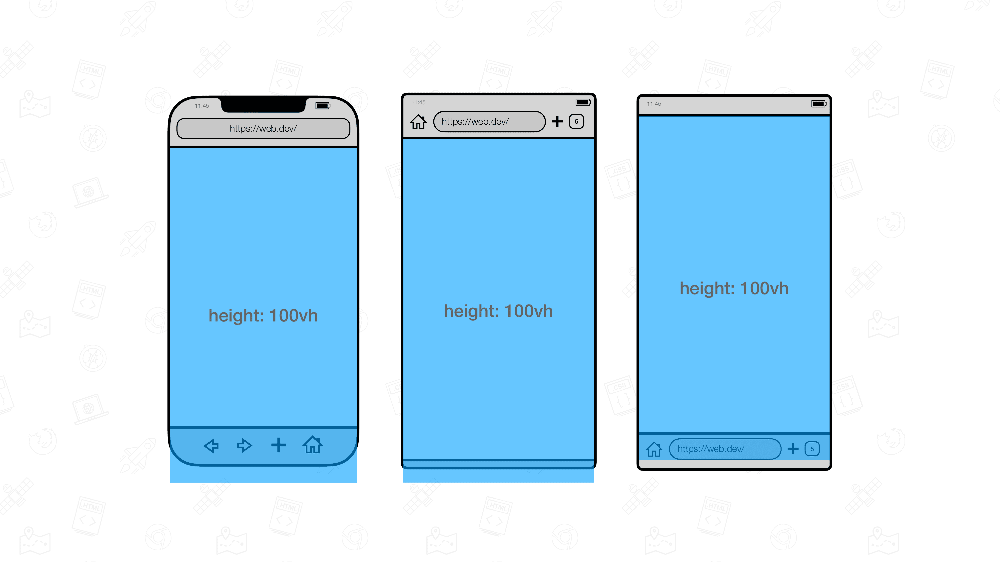

使用 CSS 视图单位可以指定元素相对于整个 viewport (通常情况下即为整个浏览器页面) 的占比大小。例如 `100vh` 可以指定元素高度即为整个页面的高度，这个高度是整个网页的页面高度，其中不包括浏览器的 URL 工具栏等元素高度。

但在部分移动端的浏览器当中，浏览器的工具栏高度也会被算入整个视图的尺寸，从而造成指定 `100vh` 的元素仍然会出现溢出屏幕页面的效果，如下图所示：

上图来自文章 [The large, small, and dynamic viewport units](https://web.dev/blog/viewport-units)

解决的办法包括：

- 给 `<html>` 元素设置 `height: 100%` 属性使得页面占满整个屏幕高度

- 改用 `fixed` 定位进行布局

- 改用 `dvh` 单位

## See Also

- [100vh height when address bar is shown - Chrome Mobile - StackOverflow](https://stackoverflow.com/questions/52848856/100vh-height-when-address-bar-is-shown-chrome-mobile)

- [The large, small, and dynamic viewport units](https://web.dev/blog/viewport-units)

- [CSS \*vh (dvh, lvh, svh) and \*vw units](https://dev.to/frehner/css-vh-dvh-lvh-svh-and-vw-units-27k4)
